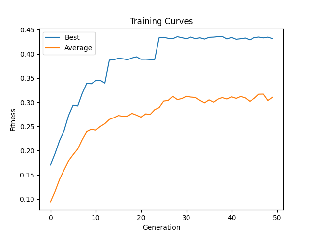
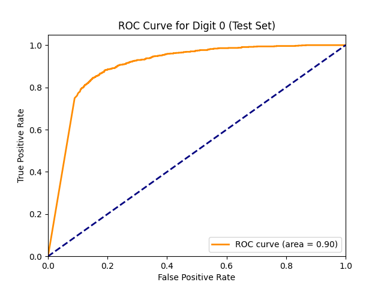
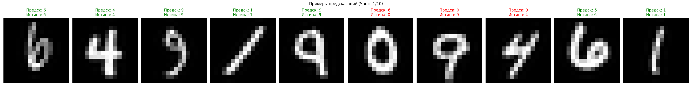
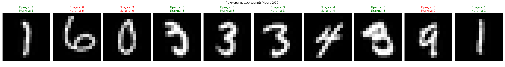
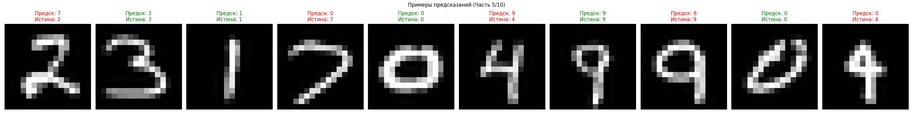
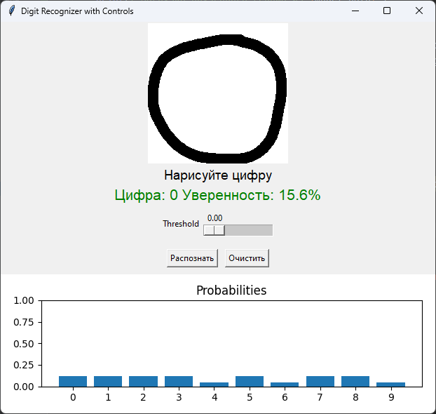
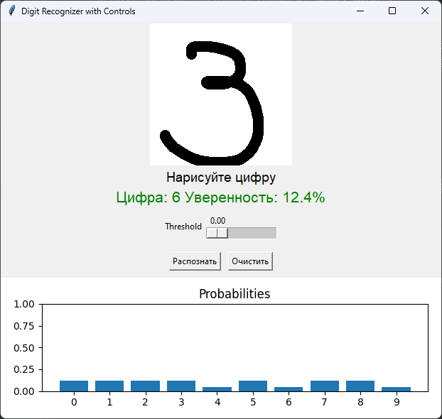
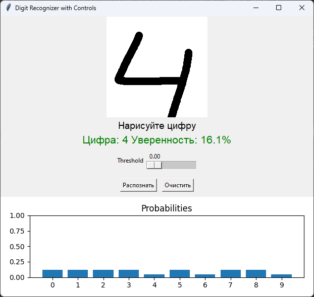
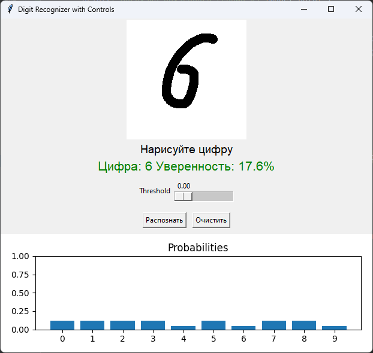
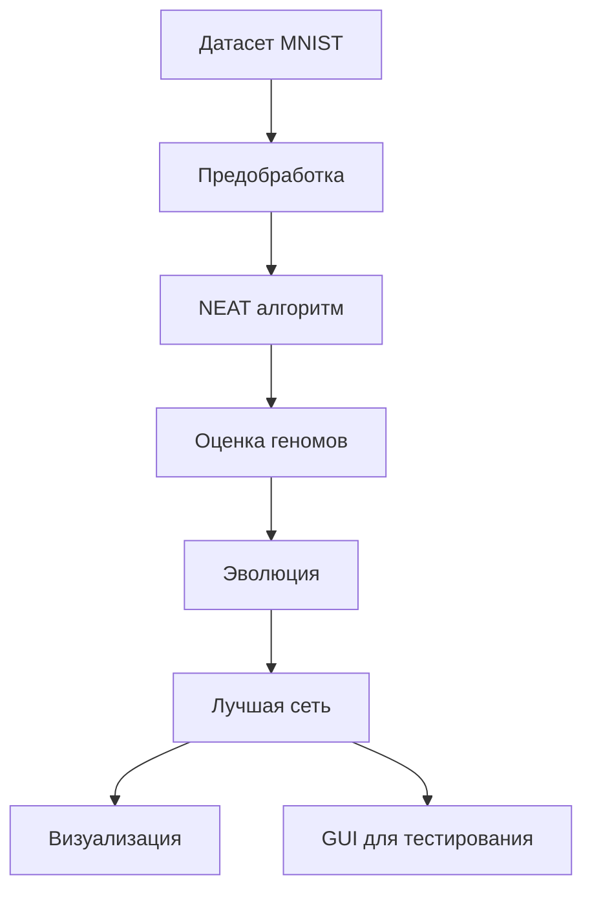

# NEAT-MNIST Classifier: Распознавание рукописных цифр с использованием нейроэволюции

## 📝 О проекте

Проект реализует классификатор рукописных цифр из датасета MNIST с использованием алгоритма NEAT (NeuroEvolution of Augmenting Topologies). Это эволюционный подход к созданию искусственных нейронных сетей, где топология сети развивается вместе с весами.

**Ключевые характеристики:**
- Эволюционное обучение нейронных сетей
- Работа с изображениями 16x16 пикселей
- Параллельные вычисления для ускорения обучения
- Интерактивный интерфейс для тестирования
- Подробная визуализация результатов

## 📊 Результаты обучения

### Основные метрики
| Метрика               | Значение |
|-----------------------|----------|
| Точность на тестах    | 42.9%    |
| Лучшая приспособленность | 0.4314   |
| Поколений обучения    | 50       |

### Графики и визуализации

#### 1. Динамика обучения


#### 2. Матрица ошибок


#### 3. ROC-кривая для цифры 0


#### 4. Примеры предсказаний










## 🛠 Технические детали

### Архитектура решения

## Конфигурационный файл
```
[NEAT]
pop_size = 150
fitness_threshold = 0.95

[DefaultGenome]
num_inputs = 256
num_outputs = 10
activation_default = sigmoid
node_add_prob = 0.3
```