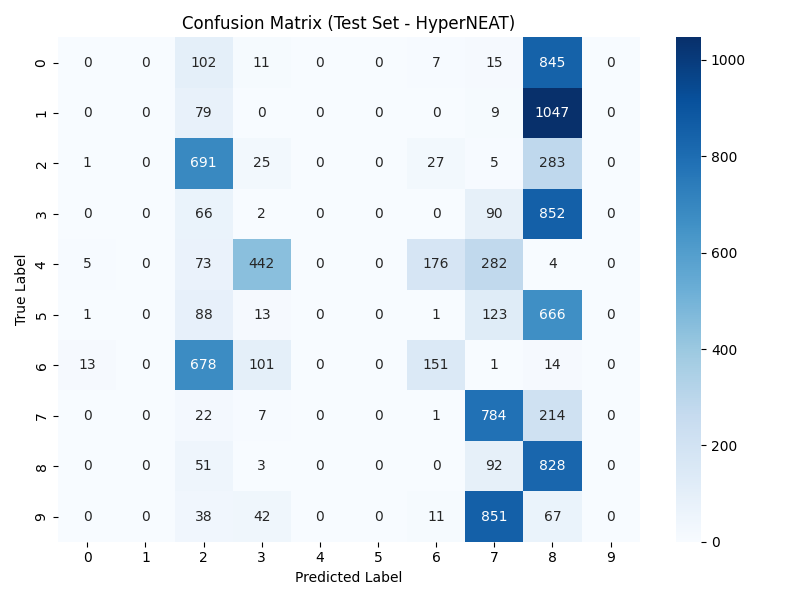
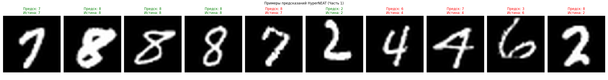
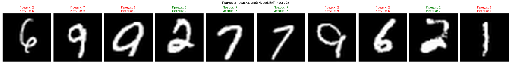
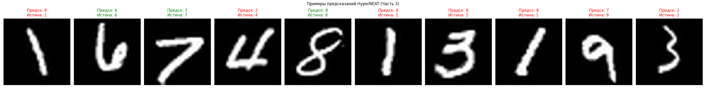
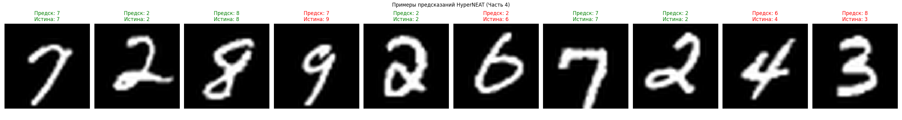
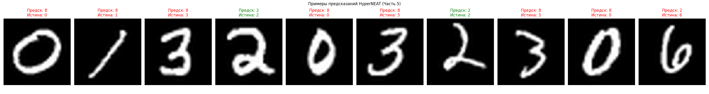
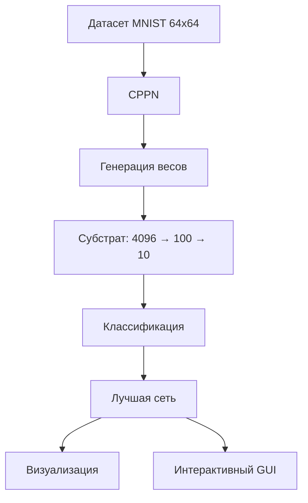

# HyperNEAT-MNIST: Распознавание цифр с использованием нейроэволюционных субстратов

## 📝 О проекте

Реализация классификатора рукописных цифр MNIST с использованием алгоритма HyperNEAT (Hypercube-based NeuroEvolution of Augmenting Topologies). 

Этот подход расширяет классический NEAT, используя паттерны для генерации весов нейронной сети через CPPN (Compositional Pattern-Producing Network).

**Ключевые особенности:**
- Генерация субстрата 64x64 → 10x10 → 10
- Параллельные вычисления для ускорения обучения
- Интерактивный интерфейс для тестирования
- Подробная визуализация результатов

## 📊 Результаты обучения

### Основные метрикиx
| Метрика               | Значение   |
|-----------------------|------------|
| Точность на тестах    | 24.56%     |
| Лучшая приспособленность | 0.25125   |
| Поколений обучения    | 100        |
| Размер популяции      | 150        |

### Матрица ошибок


### Примеры предсказаний







## 🧠 Архитектура решения



## Конфигурационный файл
```
[NEAT]
pop_size = 150
fitness_threshold = 0.92

[DefaultGenome]
num_inputs = 5       # (x_src, y_src, x_tgt, y_tgt, bias)
num_outputs = 1      # Вес связи
activation_default = tanh
node_add_prob = 0.5
conn_add_prob = 0.6
```